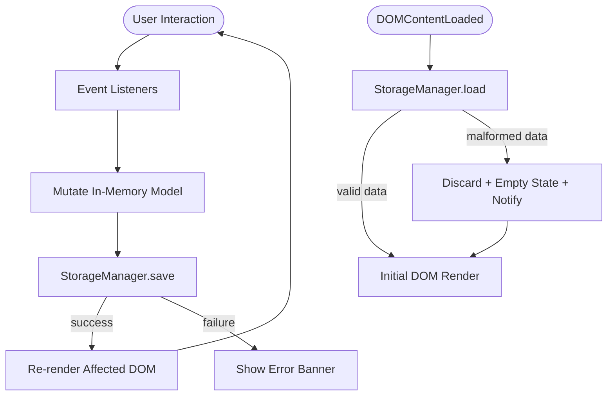
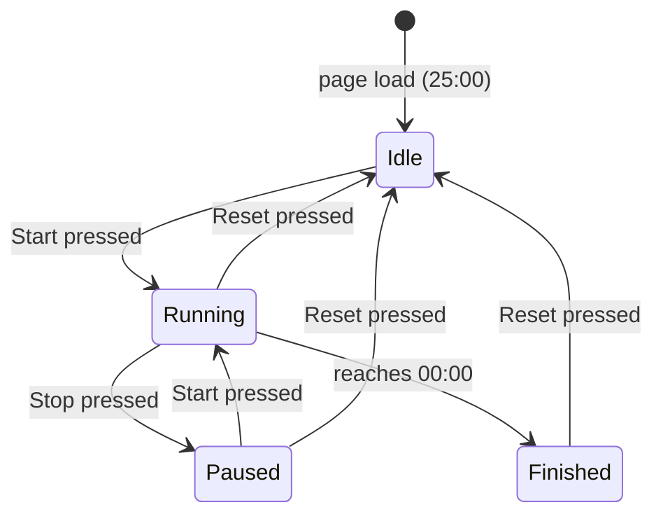

# Design Document — To-Do List Life Dashboard

## Overview

The To-Do List Life Dashboard is a zero-dependency, client-side single-page application (SPA) delivered as a static set of three files: `index.html`, `css/style.css`, and `js/app.js`. There is no build step, no package manager, and no backend server. The application opens directly in any modern browser by double-clicking `index.html` or serving it over a local static server.

The dashboard is composed of four independent, self-contained widgets rendered inside a responsive CSS grid:

| Widget | Responsibility |
|---|---|
| **Greeting_Widget** | Displays current time (live, locale-aware), current date, and a time-based greeting message |
| **Focus_Timer** | 25-minute Pomodoro countdown with Start / Stop / Reset controls |
| **Todo_List** | CRUD task manager with inline editing and completion toggling |
| **Quick_Links** | Bookmarked URL launcher stored as labelled buttons |

All user data — tasks and quick links — is persisted exclusively through the browser's `localStorage` Web API. No cookies, no IndexedDB, no network requests.

### Design Goals

- **No framework dependency.** Every interaction is handled with plain DOM APIs.
- **Single JavaScript file.** All logic lives in `js/app.js`, organized as a set of module-like IIFE namespaces.
- **Single CSS file.** All visual rules live in `css/style.css` — no inline styles, no shadow DOM, no CSS-in-JS.
- **Graceful degradation.** Storage errors are caught, surfaced to the user, and do not crash the application.
- **Cross-browser compatibility.** Targets the current stable release of Chrome, Firefox, Edge, and Safari.

---

## Architecture

The application follows a simple **event-driven MVC** pattern without a formal framework:

- **Model** — Plain JavaScript objects and arrays held in module-level variables, serialized to / deserialized from `localStorage` by the `StorageManager` module.
- **View** — Pure DOM manipulation functions that read from the model and re-render affected sections of the DOM.
- **Controller** — Event listeners attached to the document or specific elements that call model-mutation functions and then trigger view updates.

Because there is no virtual DOM, re-renders are scoped: when a single task changes, only that task's DOM node is updated, not the entire list.

### Module Organization (inside `js/app.js`)

```
js/app.js
├── StorageManager        — read/write/parse localStorage; error handling
├── GreetingWidget        — time display, date display, greeting logic, 1-second tick
├── FocusTimer            — countdown state machine, control enable/disable logic
├── TodoList              — task CRUD, inline edit state, DOM rendering
├── QuickLinks            — link CRUD, URL normalization, DOM rendering
└── App.init()            — bootstraps all modules on DOMContentLoaded
```

Each module exposes only the methods that other modules need to call. All internal state is private to the module closure.

### Data Flow



### Timer State Machine



---

## Components and Interfaces

### StorageManager

Responsible for all `localStorage` interactions. All other modules call this; none access `localStorage` directly.

```javascript
StorageManager = {
  // Reads and JSON-parses a key. Returns null on missing or parse failure.
  // Sets an internal flag on parse failure so callers can show a notification.
  load(key): Array | null,

  // JSON-serializes value and writes to localStorage.
  // Returns { ok: true } on success, { ok: false, error: Error } on failure.
  save(key, value): { ok: boolean, error?: Error },

  KEYS: {
    TASKS: 'dashboard_tasks',
    LINKS: 'dashboard_links'
  }
}
```

**Design decision:** `save()` returns a result object rather than throwing, so callers can decide how to respond to a write failure (revert in-memory state, show banner) without needing try/catch everywhere.

---

### GreetingWidget

Owns a `setInterval` that fires every 1 000 ms and updates the time display and greeting.

```javascript
GreetingWidget = {
  init(): void,              // attaches interval, renders immediately
  _tick(): void,             // called by interval; updates time, date, greeting
  _getGreeting(hour): string // pure function: hour (0-23) → greeting string
}
```

`_getGreeting` is a pure function, making it straightforwardly unit-testable.

---

### FocusTimer

Implements the state machine described above. Uses `setInterval` for the countdown tick.

```javascript
FocusTimer = {
  init(): void,
  _start(): void,
  _stop(): void,
  _reset(): void,
  _tick(): void,             // decrements remainingSeconds; checks for 00:00
  _updateUI(): void,         // formats MM:SS, enables/disables buttons, shows alert
  _formatTime(seconds): string  // pure: 1500 → "25:00", 61 → "01:01"
}

// Internal state (private):
// remainingSeconds: number  (initial: 1500)
// state: 'idle' | 'running' | 'paused' | 'finished'
// intervalId: number | null
```

---

### TodoList

Manages the task collection. Maintains an `editingId` field to track which task (if any) is currently in edit mode.

```javascript
TodoList = {
  init(): void,              // loads from StorageManager, renders
  _addTask(text): void,
  _deleteTask(id): void,
  _startEdit(id): void,
  _saveEdit(id, newText): void,
  _cancelEdit(id): void,
  _toggleComplete(id): void,
  _render(): void,           // full list re-render (called on load and structural changes)
  _renderTask(task): HTMLElement,  // creates DOM for a single task row
  _validateInput(text): { valid: boolean, error?: string }  // pure validation
}

// Task object shape (in-memory):
// { id: string, text: string, completed: boolean }
```

**Design decision:** Task IDs are generated with `Date.now().toString(36) + Math.random().toString(36).slice(2)` — a short, collision-resistant string that works without a UUID library.

---

### QuickLinks

Manages the links collection and URL normalization.

```javascript
QuickLinks = {
  init(): void,              // loads from StorageManager, renders
  _addLink(label, url): void,
  _deleteLink(id): void,
  _openLink(url): void,      // window.open with popup-blocked detection
  _normalizeUrl(url): string, // pure: ensures https:// prefix
  _render(): void,
  _renderLink(link): HTMLElement,
  _validateInputs(label, url): { valid: boolean, labelError?: string, urlError?: string }
}

// Link object shape (in-memory):
// { id: string, label: string, url: string }
```

---

### App (bootstrap)

```javascript
App = {
  init(): void  // called on DOMContentLoaded; calls each module's init() in order
}

document.addEventListener('DOMContentLoaded', App.init);
```

---

## Data Models

### Task

Stored in `localStorage` under key `dashboard_tasks` as a JSON array.

```json
[
  {
    "id": "lf3k2abc",
    "text": "Buy groceries",
    "completed": false
  },
  {
    "id": "lf3k2xyz",
    "text": "Finish report",
    "completed": true
  }
]
```

| Field | Type | Constraints |
|---|---|---|
| `id` | string | Non-empty, unique within the collection |
| `text` | string | 1–500 characters after trimming; no leading/trailing whitespace stored |
| `completed` | boolean | `true` = done, `false` = incomplete |

**Invariant:** No two tasks in the stored array share the same `id`.

---

### Link

Stored in `localStorage` under key `dashboard_links` as a JSON array.

```json
[
  {
    "id": "lf3k2def",
    "label": "GitHub",
    "url": "https://github.com"
  }
]
```

| Field | Type | Constraints |
|---|---|---|
| `id` | string | Non-empty, unique within the collection |
| `label` | string | 1–100 characters after trimming |
| `url` | string | 1–2048 characters; always begins with `http://` or `https://` after normalization |

**Invariant:** Every stored URL begins with `http://` or `https://`.

---

### Storage Layout

| Key | Value shape | Description |
|---|---|---|
| `dashboard_tasks` | `Task[]` (JSON array) | Ordered list of task objects |
| `dashboard_links` | `Link[]` (JSON array) | Ordered list of link objects |

Both keys are absent on first load and are only written when the first item is added.

---

### Serialization Contract

- **Write path:** `JSON.stringify(array)` → `localStorage.setItem(key, serialized)`
- **Read path:** `localStorage.getItem(key)` → `JSON.parse(raw)` → validate `Array.isArray(result)`
- If `getItem` returns `null` (key absent) → treat as empty array, no error.
- If `JSON.parse` throws or result is not an array → discard, use `[]`, surface a notification.


---

## Correctness Properties

*A property is a characteristic or behavior that should hold true across all valid executions of a system — essentially, a formal statement about what the system should do. Properties serve as the bridge between human-readable specifications and machine-verifiable correctness guarantees.*

### Property 1: Greeting bands are exhaustive and non-overlapping

*For any* integer hour value in the range [0, 23], `_getGreeting(hour)` shall return exactly one of "Good Morning", "Good Afternoon", "Good Evening", or "Good Night", and no two distinct hour values that fall in the same named period shall return different strings.

Specifically:
- Hours [5, 11] → "Good Morning"
- Hours [12, 16] → "Good Afternoon"
- Hours [17, 20] → "Good Evening"
- Hours {21, 22, 23, 0, 1, 2, 3, 4} → "Good Night"
- Any value outside [0, 23] (e.g., NaN, -1, 24) → "Hello" (fallback)

**Validates: Requirements 2.1, 2.2, 2.3, 2.4, 2.7**

---

### Property 2: Timer format is a lossless round-trip

*For any* integer seconds value `s` in the range [0, 1500], `_formatTime(s)` shall produce a string of the form `MM:SS` such that parsing the minutes and seconds out of the string and computing `parsedMinutes * 60 + parsedSeconds` yields exactly `s`.

**Validates: Requirements 3.1, 4.1, 4.2, 4.3, 4.4**

---

### Property 3: Valid task text is always accepted

*For any* string `text` that contains at least one non-whitespace character and whose length after trimming is between 1 and 500 characters inclusive, calling `_addTask(text)` shall increase the task list length by exactly 1, and the new task's stored text shall equal `text.trim()`.

**Validates: Requirements 5.2**

---

### Property 4: Whitespace-only input is always rejected

*For any* string composed entirely of whitespace characters (space `U+0020`, tab `U+0009`, carriage return `U+000D`, newline `U+000A`, or any combination thereof), both `_addTask(text)` and `_saveEdit(id, text)` shall reject the input, leave the task collection unchanged, and not write to `localStorage`.

**Validates: Requirements 5.5, 6.7**

---

### Property 5: Over-length task input is always rejected

*For any* string whose length is strictly greater than 500 characters, `_addTask(text)` shall reject the input, leave the task collection unchanged, and not write to `localStorage`.

**Validates: Requirements 5.6**

---

### Property 6: Task collection serialization is a round-trip

*For any* array of valid Task objects `tasks` (each with a unique non-empty `id`, trimmed non-empty `text` of length ≤ 500, and boolean `completed`), serializing the array with `JSON.stringify(tasks)` and then deserializing with `JSON.parse(serialized)` shall produce an array that is element-wise equivalent to `tasks`, preserving `id`, `text`, and `completed` character-for-character.

**Validates: Requirements 9.4**

---

### Property 7: Completion toggle is a round-trip

*For any* task with any initial `completed` value, toggling the task's completion status twice (via two calls to `_toggleComplete(id)`) shall restore `completed` to its original value, and the task's `text` and `id` shall remain unchanged.

**Validates: Requirements 7.2, 7.3**

---

### Property 8: Deletion removes exactly the targeted task

*For any* task list containing at least one task, deleting a specific task by its `id` shall produce a task list that does not contain any task with that `id`, has a length of exactly `originalLength - 1`, and preserves all other tasks with their original `text` and `completed` values in the same relative order.

**Validates: Requirements 8.2**

---

### Property 9: URL normalization always produces an absolute URL

*For any* URL string `url`, `_normalizeUrl(url)` shall return a string that begins with either `"http://"` or `"https://"`. If `url` already begins with `"http://"` or `"https://"`, the returned string shall equal `url` unchanged. If `url` does not begin with either prefix, `"https://"` shall be prepended.

**Validates: Requirements 10.3**

---

### Property 10: Link collection serialization is a round-trip

*For any* array of valid Link objects `links` (each with a unique non-empty `id`, trimmed non-empty `label` of length ≤ 100, and normalized `url` of length ≤ 2048), serializing with `JSON.stringify(links)` and deserializing with `JSON.parse(serialized)` shall produce an array that is element-wise equivalent to `links`, preserving `label` and `url` character-for-character.

**Validates: Requirements 13.5, 13.6**

---

### Property 11: Malformed storage data always yields null, never throws

*For any* string `raw` that is not parseable as a valid JSON array (including strings that are valid JSON but not arrays — e.g., `"{}"`, `"null"`, `"42"`, `"\"text\""` — and strings that are not valid JSON at all), calling `StorageManager.load(key)` when `localStorage` contains `raw` shall return `null` without throwing an exception.

**Validates: Requirements 14.2, 9.5, 13.4**

---

## Error Handling

### Storage Write Failures

All `localStorage.setItem` calls are wrapped in a try/catch inside `StorageManager.save()`. On failure:

1. `save()` returns `{ ok: false, error }` — it does not throw.
2. The calling module (TodoList, QuickLinks) reverts the in-memory mutation it had applied before calling `save()`.
3. A dismissible error banner is inserted into the DOM: `"Your changes could not be saved. Storage may be full."` The banner persists until the user explicitly closes it.

This ensures the UI always reflects what is actually persisted — there is no divergence between displayed state and stored state.

### Storage Read Failures (on Load)

`StorageManager.load()` wraps `JSON.parse` in a try/catch and validates `Array.isArray(result)`:

- `localStorage.getItem` returns `null` → return `[]` silently (first visit, no data).
- `JSON.parse` throws → return `null`, set an internal `parseError` flag.
- `JSON.parse` succeeds but result is not an array → return `null`, set `parseError` flag.

When `load()` returns `null`, the calling widget initializes with an empty collection and inserts a non-blocking notification: `"Previous [tasks/links] could not be loaded. Starting fresh."` The notification auto-dismisses after 8 seconds or on user click.

### Timer Edge Cases

- If `setInterval` is called while an interval is already active (e.g., double Start), the existing interval is kept and no second interval is created. This is enforced by checking `state !== 'running'` before calling `setInterval`.
- On page visibility change (`visibilitychange` event), the timer does not pause — this is intentional. The Pomodoro spec does not require tab-aware pausing.

### Popup Blocker (Quick Links)

`window.open()` returns `null` when blocked. After every call, the return value is checked:

```javascript
const tab = window.open(url, '_blank', 'noopener,noreferrer');
if (tab === null) {
  showNotification('Could not open the link. Please allow popups for this page.');
}
```

### Input Validation Error Display

Validation errors are shown as inline messages immediately adjacent to the offending input field (not as global toasts). The error message is cleared as soon as the user modifies the input field value.

---

## Testing Strategy

### Overview

This project has no build step and no test runner configured. The testing strategy is designed for plain JavaScript environments and is oriented around two complementary approaches:

1. **Example-based unit tests** — verify specific behaviors, edge cases, and state transitions using concrete inputs.
2. **Property-based tests** — verify universal correctness properties (as defined in the Correctness Properties section above) across many randomly generated inputs.

### Recommended Tooling

| Layer | Tool | Rationale |
|---|---|---|
| Unit + Property tests | [fast-check](https://github.com/dubzzz/fast-check) + a browser-compatible test runner (e.g., [Vitest](https://vitest.dev/) with `jsdom`) | fast-check is a mature JS/TS property-based testing library; Vitest runs in jsdom without a browser |
| Cross-browser smoke | Manual + browser DevTools | No build step; cross-browser verification is manual |
| Visual regression | Manual viewport resize inspection | No build step; no headless browser configured |

**Note:** Because the application is vanilla JS with no module system, the pure functions (`_getGreeting`, `_formatTime`, `_normalizeUrl`, `_validateInput`) should be extracted into testable exports (or tested by importing the app file in a CJS/ESM wrapper). A thin test harness file can `require`/`import` `js/app.js` using a jsdom environment.

### Property-Based Test Configuration

- Each property test runs a **minimum of 100 iterations**.
- Each test is tagged with a comment referencing the design property it validates.
- Tag format: `// Feature: todo-life-dashboard, Property N: <property title>`

### Example-Based Unit Tests

Cover the following behavioral scenarios:

| Test | Requirement |
|---|---|
| Timer initializes to "25:00" | Req 3.1 |
| Timer decrements correctly after N seconds (fake clock) | Req 3.2 |
| Timer shows "00:00" and alert at end | Req 3.3, 3.4 |
| Start while running is ignored | Req 3.5 |
| Stop retains remaining time | Req 4.2 |
| Resume from paused continues from retained time | Req 4.3 |
| Reset stops countdown and shows "25:00" | Req 4.4, 4.8 |
| Button enable/disable states for each timer state | Req 4.5, 4.6, 4.7 |
| Adding a task clears the input field | Req 5.4 |
| Editing a task pre-populates the edit input | Req 6.2 |
| Opening a second edit closes the first without saving | Req 6.3 |
| Cancel edit restores original text | Req 6.6 |
| Storage write failure reverts in-memory state | Req 14.1 |
| Task in edit mode can be deleted | Req 8.4 |
| Popup-blocked link shows notification | Req 11.2 |
| Greeting updates when clock crosses boundary | Req 2.5 |
| Date display format matches expected locale string | Req 1.3 |

### Property-Based Tests (linked to Correctness Properties)

| Property | Test description |
|---|---|
| Property 1 | For all hours [0,23] and edge inputs (NaN, -1, 24), `_getGreeting` returns the correct greeting with no exceptions |
| Property 2 | For all `s` in [0,1500], `_formatTime(s)` is losslessly round-trippable |
| Property 3 | For all valid task strings (length 1–500, contains non-whitespace), `_addTask` grows the list by 1 |
| Property 4 | For all whitespace-only strings, both `_addTask` and `_saveEdit` reject without mutating state |
| Property 5 | For all strings with length > 500, `_addTask` rejects without mutating state |
| Property 6 | For all arrays of valid Tasks, `JSON.stringify` → `JSON.parse` is identity |
| Property 7 | For all tasks, toggling twice restores original `completed` value |
| Property 8 | For all task lists with ≥1 item, deleting one item produces a list without that item and with length `n-1` |
| Property 9 | For all URL strings, `_normalizeUrl` produces a string starting with `http://` or `https://` |
| Property 10 | For all arrays of valid Links, `JSON.stringify` → `JSON.parse` is identity preserving label and URL |
| Property 11 | For all non-JSON-array strings, `StorageManager.load` returns `null` without throwing |

### Smoke Tests (Manual)

| Check | Requirement |
|---|---|
| Open `index.html` in Chrome — no console errors, all widgets render | Req 16.3 |
| Open in Firefox, Edge, Safari — same as above | Req 16.4 |
| Resize viewport below 768px — single-column layout applied | Req 15.4 |
| Resize viewport to ≥768px — multi-column grid applied | Req 15.3 |
| All body text readable at default zoom (≥14px) | Req 15.5 |
